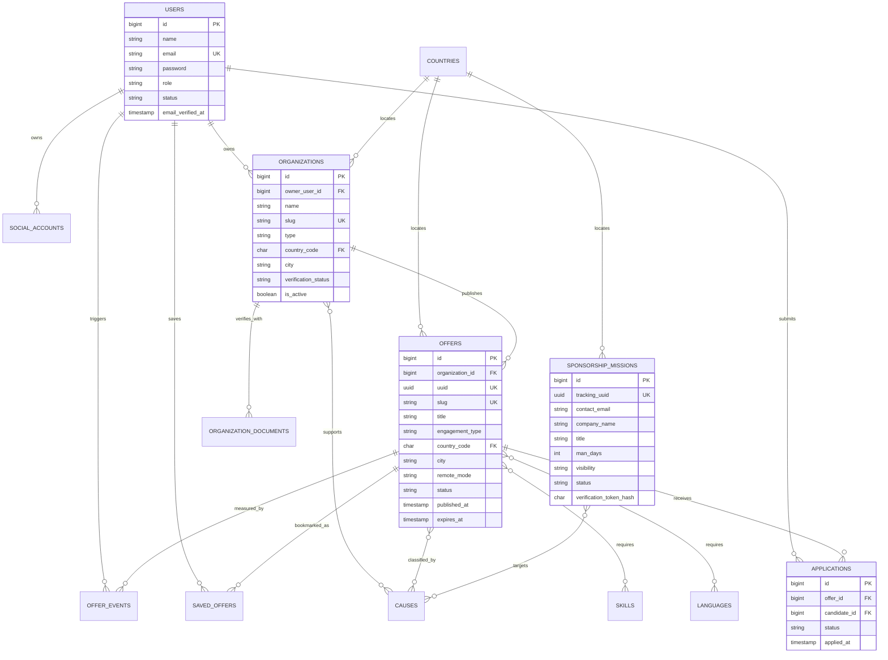

# Entity relationship diagram

## Design rules

- Human-facing URLs use stable unique slugs.
- External/private tracking uses UUIDs.
- User roles and statuses are strings cast to PHP enums.
- Many-to-many taxonomies avoid duplicated text in organizations and offers.
- Uploaded verification documents and CVs are stored privately.
- Searchable columns have targeted indexes; pivot foreign keys are composite primary keys.
- Applications and saved offers use database uniqueness to enforce idempotency.
